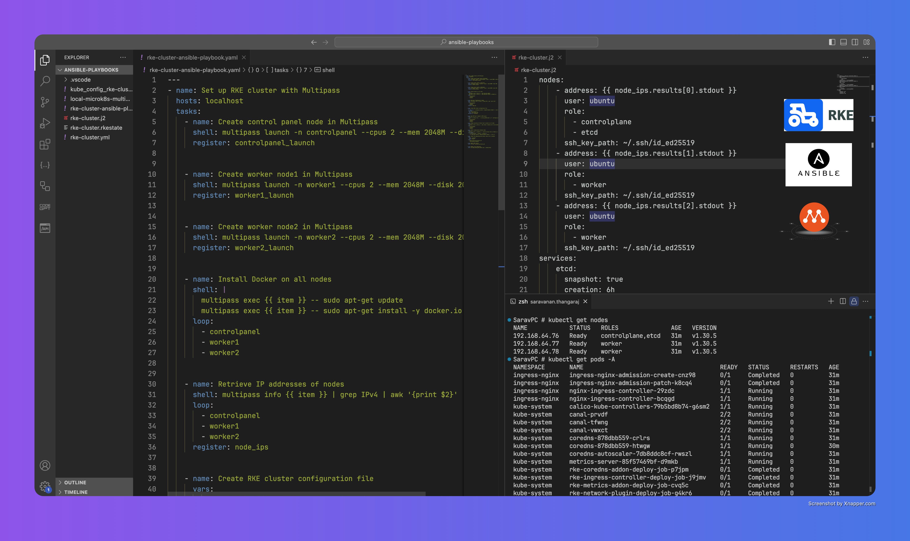

# RKE Multi-Node Cluster Setup with Multipass

This Ansible playbook automates the setup of a Rancher Kubernetes Engine (RKE) cluster using Multipass virtual machines on your local machine. The cluster consists of one control plane node and two worker nodes.



## Prerequisites

Before running this playbook, ensure you have the following installed on your system:

1. [Multipass](https://multipass.run/) - for creating and managing Ubuntu VMs
2. [Ansible](https://docs.ansible.com/ansible/latest/installation_guide/index.html) - for running the playbook
3. [RKE](https://rancher.com/docs/rke/latest/en/installation/) - Rancher Kubernetes Engine CLI tool
4. SSH key pair (ED25519) - Generate using `ssh-keygen -t ed25519` if not present
5. kubectl - for interacting with the cluster once it's set up

## Cluster Architecture

The playbook creates the following setup:
- 1 Control plane node (2 CPU, 2GB RAM, 20GB disk)
- 2 Worker nodes (2 CPU, 2GB RAM, 20GB disk each)

## How to Use

1. Clone this repository:
   ```bash
   git clone <repository-url>
   cd <repository-name>
   ```

2. Ensure both playbook files are present:
   - `rke-cluster-ansible-playbook.yaml`
   - `rke-cluster.j2`

3. Run the playbook:
   ```bash
   ansible-playbook rke-cluster-ansible-playbook.yaml
   ```

## What the Playbook Does

The playbook performs the following steps automatically:

1. Creates three Multipass VMs:
   - controlpanel
   - worker1
   - worker2

2. Installs Docker on all nodes

3. Retrieves IP addresses of all nodes

4. Creates RKE cluster configuration using the template

5. Copies your SSH public key to all nodes

6. Configures Docker permissions on all nodes

7. Sets up firewall rules to allow inter-node communication

8. Deploys the RKE cluster

9. Configures kubectl by updating the kubeconfig file

## Verification

After the playbook completes, verify your cluster is running:

```bash
kubectl get nodes
```

You should see three nodes (one control plane and two workers) in Ready state.

## Cleanup

To remove the cluster and VMs:

```bash
multipass delete --purge controlpanel worker1 worker2
multipass purge

```

## Notes

- The playbook uses ED25519 SSH keys by default (`~/.ssh/id_ed25519`)
- The control plane node also runs etcd
- Etcd snapshots are configured to run every 6 hours with 24-hour retention
- Make sure you have sufficient system resources to run three VMs simultaneously

## Troubleshooting

If you encounter issues:

1. Ensure all prerequisites are properly installed
2. Check if Multipass can create VMs: `multipass list`
3. Verify SSH key permissions (should be 600)
4. Check node connectivity: `multipass shell <node-name>`

## Contributing

Feel free to submit issues and enhancement requests!

## Leave a Star ⭐️ if you found this useful

follow me on LinkedIn [@aksarav](https://www.linkedin.com/in/aksarav/)
read my blog [@middlewareinventory](https://middlewareinventory.com/)